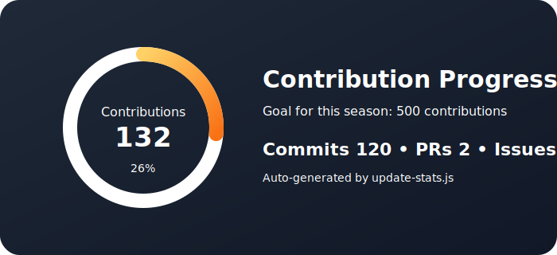
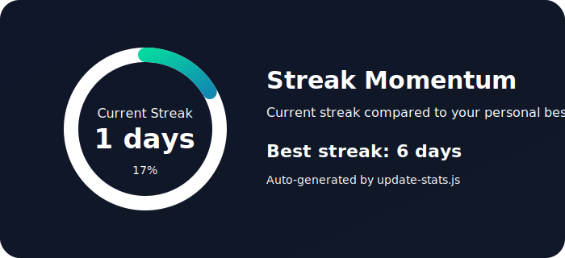

# Hi there, I'm Mohammed Khatiri 👋

A computer science enthusiast specializing in **Artificial Intelligence** and **Big Data**, passionate about exploring and analyzing large-scale data.

[](https://mokhatiri.github.io)
[](https://www.linkedin.com/in/khatirimohammed)
[](mailto:mohamed.khatiri2006@gmail.com)

---

## 📊 GitHub Stats



`Repositories:` **11** • `Stars:` **1** • `Followers:` **13** • `Following:` **12**

`Contribution target:` **500** • `Progress:` **35.6%**

## 🔥 Contribution Streak



`Total contributions:` **178** • `Current streak:` **0 days** • `Longest streak:` **7 days** • `Momentum:` **0.0%**

## 💻 Top Languages

```
Vue             ██████░░░░░░░░░░░░░░ 30.0%
JavaScript      ██░░░░░░░░░░░░░░░░░░ 10.0%
Python          ██░░░░░░░░░░░░░░░░░░ 10.0%
C++             ██░░░░░░░░░░░░░░░░░░ 10.0%
Java            ██░░░░░░░░░░░░░░░░░░ 10.0%
Jupyter Notebook ██░░░░░░░░░░░░░░░░░░ 10.0%
Rust            ██░░░░░░░░░░░░░░░░░░ 10.0%
Go              ██░░░░░░░░░░░░░░░░░░ 10.0%
```

---

## 🛠️ Tech Stack

**Languages:** Python, Java, JavaScript, TypeScript, Go, C++, C

**ML/Data:** Pandas, NumPy, PyTorch, Machine Learning, Data Preprocessing

**Web:** Django, Vue.js, Nuxt.js, REST APIs

**DevOps:** Docker, Kubernetes, GitHub Actions, Git, SonarQube

**Databases:** SQL, SQLite, Database Design, Data Modeling

---

## 📌 Featured Projects

[](https://mokhatiri.github.io)

Check out my [repositories](https://github.com/mokhatiri?tab=repositories) for more projects!

---

<p align="center">
  <i>Last updated: Thu, 16 Apr 2026 01:59:43 GMT</i>
</p>
